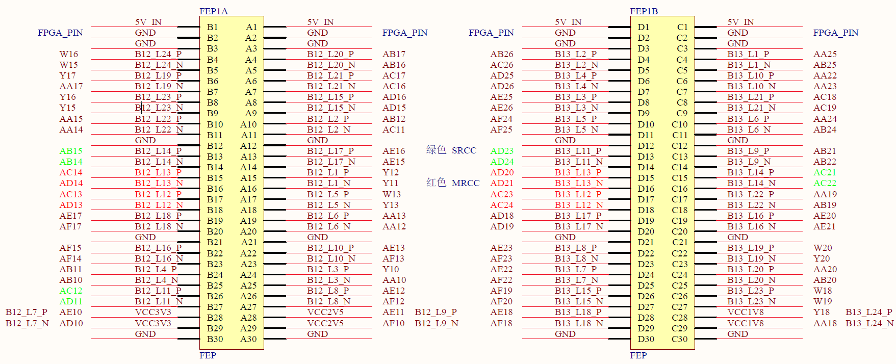
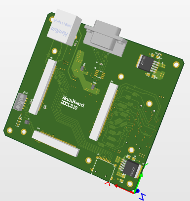
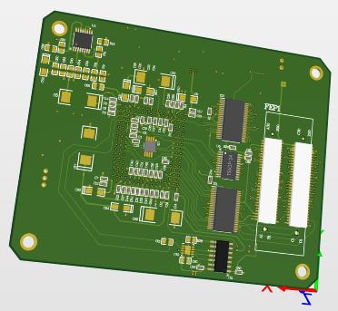

# 可重构星敏实验平台 PCB设计

## **设计子板需要知道的**
主板尺寸为`110mm × 100mm`，孔位为距离各边为`5mm`，设计子板时需要考虑定位孔的位置

字母板之间用**FEP接口**连接，FEP管脚分配定义如图所示。购买方式请去米联客淘宝店铺去购买60pin接口，子板应该需要买母头（我也搞不清楚去实际看看）

### **字母板设计**
本方案的设计初衷是，将搭载主控芯片的核心板和图像传感器及其外围电路分别放置在不同的PCB板上，二者之间使用较为通用的主板进行转接。该设计方案的好处是：若更换图像传感器，只需重新设计相应的外围电路（子板），不需要变动其他电路。  

PCB目录中`MainBoard`和`SensorBoard`，MainBoard是通用主板设计，SensorBoard是针对于GSENSE2020BSI的图像驱动板。   

主板3D渲染图  

成像子板3D渲染图  

根据实际实现效果来看，除了GSENSE2020BSI的驱动设计，实验室学长在开发另外两款成像芯片驱动时，只设计对应的子板安装到本系统上，成功进行了测试，节省了开发时间，因此可以说已经基本实现了**电路可重构**的效果。