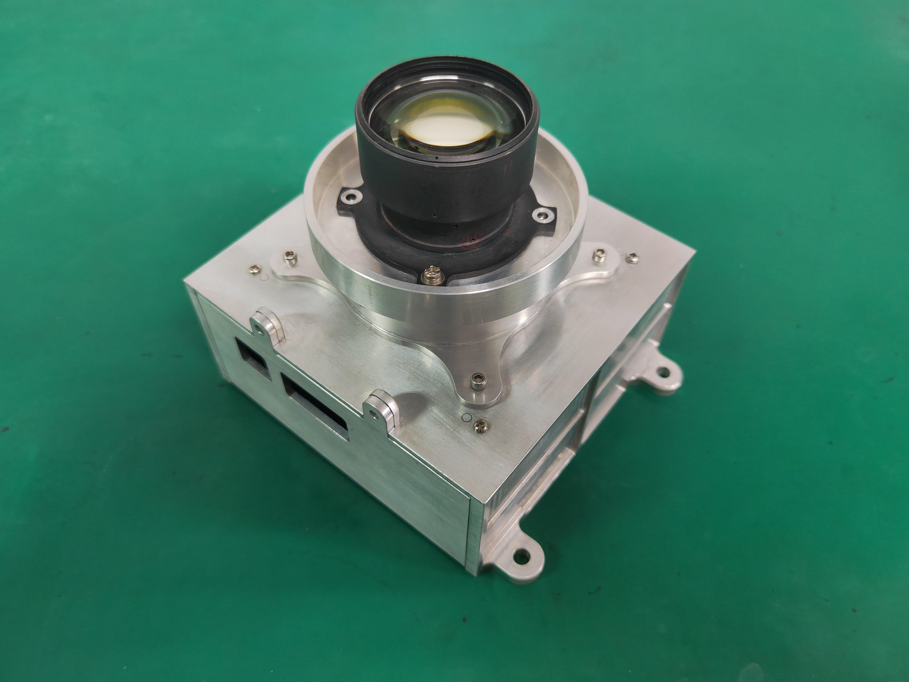
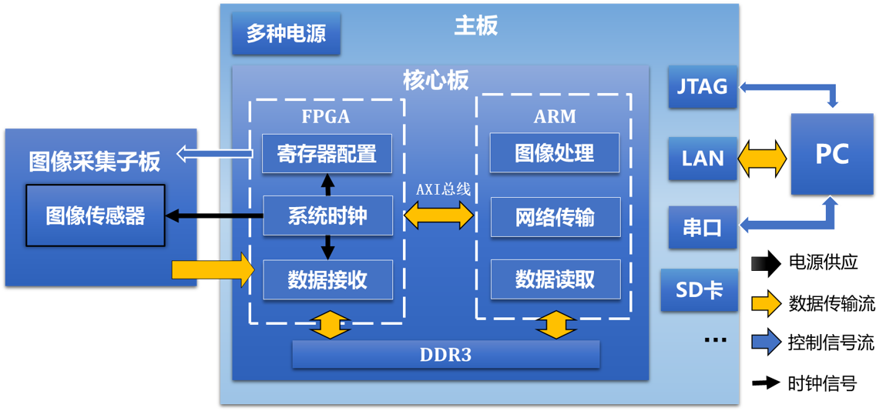
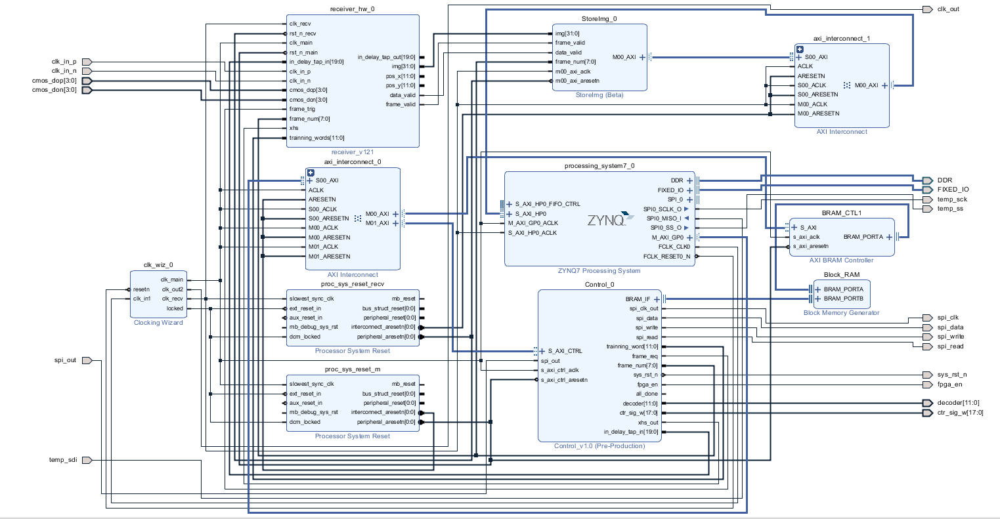
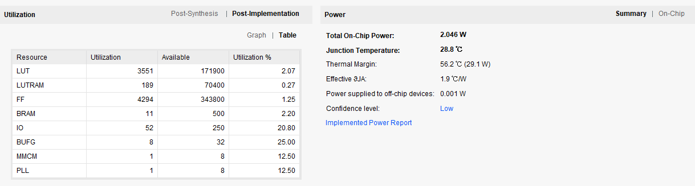

# gsense2020bsi_drive

### 常用名词缩写
PS：Processing System，即ZYNQ芯片上的双核ARM® Cortex™-A9处理器  
PL：Programmable Logic，即ZYNQ芯片上的FPGA  
AXI：Advanced eXtensible Interface，是高性能、高带宽、低延迟的片内总线，本系统中被用于片上PS和PL部分的通信。  
LVDS：Low-Voltage Differential Signaling，是低功耗、低误码率、低串扰和低辐射的差分信号，GSENSE2020BSI的图像数据通过该电平标准输出。

### 1. 介绍
一款国产卷帘曝光的CMOS驱动工程，使用Xilinx公司的ZYNQ-7035芯片。PL部分作为图像传感器接口，将多通道的图像数据整理好按照一定顺序存储到DDR中；PS实现系统初始化、寄存器配置和数据通信的功能。
PL做接口驱动电路，根据功能划分为三个模块：Control控制器，Receiver接收器和StoreImg存储器。  
PS上目前运行裸机程序，负责将CMOS参数配置，发送DDR3内存中的图像数据。

### 2. 结构
   
通用的镜头转接件可以适配多种镜头。螺纹调节焦距。  

### 3. 电路设计
本方案的设计初衷是，将搭载主控芯片的核心板和图像传感器及其外围电路分别放置在不同的PCB板上，二者之间使用较为通用的主板进行转接。该设计方案的好处是：若更换图像传感器，只需重新设计相应的外围电路（子板），不需要变动其他电路。  

  

PCB目录中MainBoard和SensorBoard，MainBoard是通用主板设计，SensorBoard是针对于GSENSE2020BSI的图像驱动板

根据实际实现效果来看，除了GSENSE2020BSI的驱动设计，实验室学长在开发另一款成像芯片驱动时，只设计对应的子板安装到本系统上，成功进行了测试，节省了开发时间，因此可以说已经基本实现了电路可重构的效果。

### 4. FPGA硬件架构

1. Control控制器：控制器IP挂载在AXI总线上，有16个32位寄存器供PS和PL通信，此外可以与PS读写一块8K的RAM。本模块的主要功能是为图像传感器提供控制信号，详细功能分别是
(1)	曝光。数据手册中规定了图像传感器工作所需要特定的18路曝光时序信号和12路行选择信号。以特定的顺序选中不同的行进行复位和读出操作，可以实现卷帘曝光以及曝光时间控制。  
(2)	寄存器配置。模块集成了一个SPI控制器，工作时，PS将数据写入共享的BRAM，本模块寄存器配置信息读出，再通过SPI总线接口发送至图像传感器，完成工作模式的配置。  
(3)	复位和上电顺序的控制。由于图像传感器上电需要特定的时间顺序，因此使用计数器对复位信号的加载做时间控制，完成图像传感器的启动。  
(4)	作为中介，为其他模块传递PS发出的指令。该模块为Receiver提供了训练字、行同步、开始接收等信号。

2. StoreImg:  存储IP将数据逐像素的图像数据写入DDR内存中，其实现参考了米联客的FDMA设计和沈永乾师兄的工程。本模块信号主要输入为数据有效（data_valid）和图像数据（img）。除此之外，本模块可以缓存多帧图像，便于后续将多帧图像的乒乓处理或者发送。
GSENSE2020BSI的图像信号img数据位宽为32-bit，单个数据包含了两个12-bit像素的信息。

3. Receiver接收器: 接收器模块是针对于GSENSE2020BSI的专用模块，其功能是匹配数据通道输出的训练字，找到有效数据的位置，并输出图像像素、当前行、当前列、行有效和帧有效的信号。
因此，该模块的输入为4路差分数据和1路差分时钟信号，输出为较为通用的图像数据接口，便于后续使用。在调试阶段，本设计选择4路输出通道和12-bit的工作模式，像素速率为40MHz，图像数据带宽为1.28Gbps。

#### 资源利用情况

#### 时钟
系统主时钟为10M，FPGA给CMOS提供的时钟为120M，CMOS的DDR串行时钟为60M
手册中要求主时钟为50M，给CMOS提供的时钟600M，CMOS的DDR串行时钟为300M

### 5. 软件
在主工程gsense2020bsi.sdk中，g2020 + g2020bsp
1. 系统启动上电后，PS将CMOS寄存器的配置数据通过AXI总线写入共享空间的RAM中，并发送命令通知PL的Control控制器读取RAM数据，再通过类似于SPI通讯的方式写入CMOS寄存器。
2. 串口通信主要用于发送和响应控制指令，目前指令有曝光、传图、更改PGA和ADC增益、更改训练字、进入到省电模式等。串口通信的实现采用之前项目中的基础，不再赘述，优点是稳定可靠，缺点是发送全图时速度较慢。
3. 网络通信功能包括响应曝光指令和图像传输。本系统使用Lwip轻量网络协议栈通过TCP/IP协议进行通信，将实验平台作为服务器，上位机作为客户端，在二者建立连接后，上位机通过发送曝光/传图指令，实验平台响应并执行对应操作。传图和显示的过程实际是将DDR内存中的数据通过TCP网络协议发送到上位机（网络调试助手）并保存到txt文件，再通过MATLAB解析文件显示出结果。

### 6. 成像效果
吓你一跳！  

